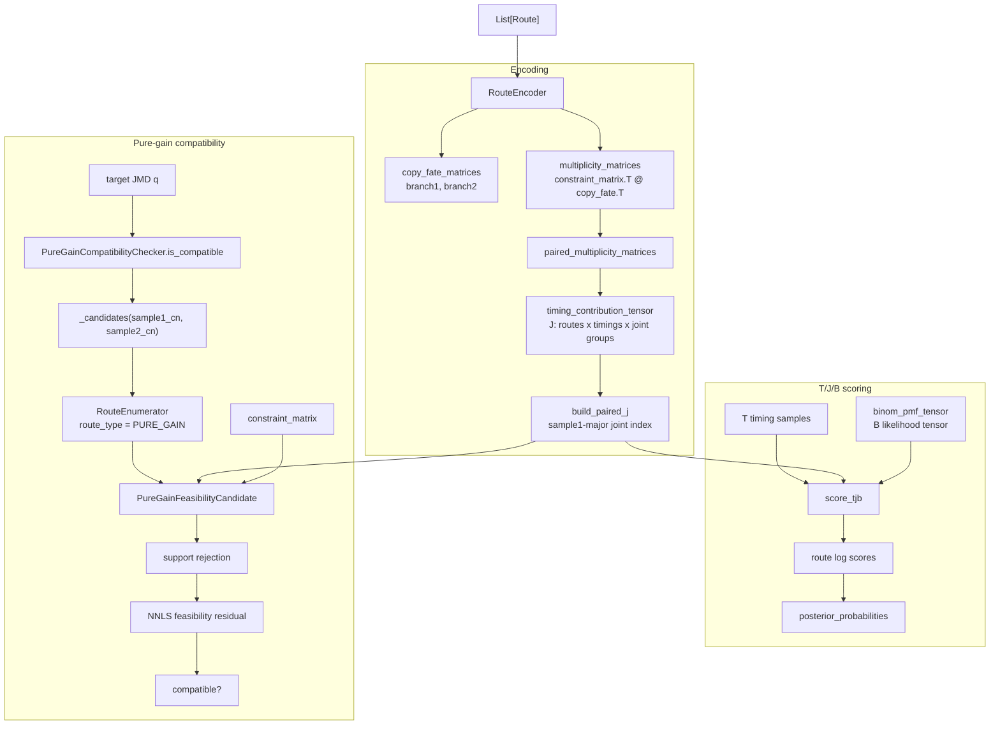

# Encoding, Scoring, And Compatibility

```mermaid
flowchart TD
    routes["List[Route]"] --> encoder["RouteEncoder"]

    subgraph Encoding["Encoding"]
        encoder --> copyFate["copy_fate_matrices<br/>branch1, branch2"]
        encoder --> mult["multiplicity_matrices<br/>constraint_matrix.T @ copy_fate.T"]
        mult --> paired["paired_multiplicity_matrices"]
        paired --> jTensor["timing_contribution_tensor<br/>J: routes x timings x joint groups"]
        jTensor --> buildJ["build_paired_j<br/>sample1-major joint index"]
    end

    subgraph Scoring["T/J/B scoring"]
        timingSamples["T timing samples"] --> score["score_tjb"]
        buildJ --> score
        binom["binom_pmf_tensor<br/>B likelihood tensor"] --> score
        score --> logScores["route log scores"]
        logScores --> posterior["posterior_probabilities"]
    end

    subgraph Compatibility["Pure-gain compatibility"]
        q["target JMD q"] --> checker["PureGainCompatibilityChecker.is_compatible"]
        checker --> candidates["_candidates(sample1_cn, sample2_cn)"]
        candidates --> routeEnum["RouteEnumerator<br/>route_type = PURE_GAIN"]
        routeEnum --> candidate["PureGainFeasibilityCandidate"]
        buildJ --> candidate
        constraint["constraint_matrix"] --> candidate
        candidate --> support["support rejection"]
        support --> nnls["NNLS feasibility residual"]
        nnls --> compatible["compatible?"]
    end
```
