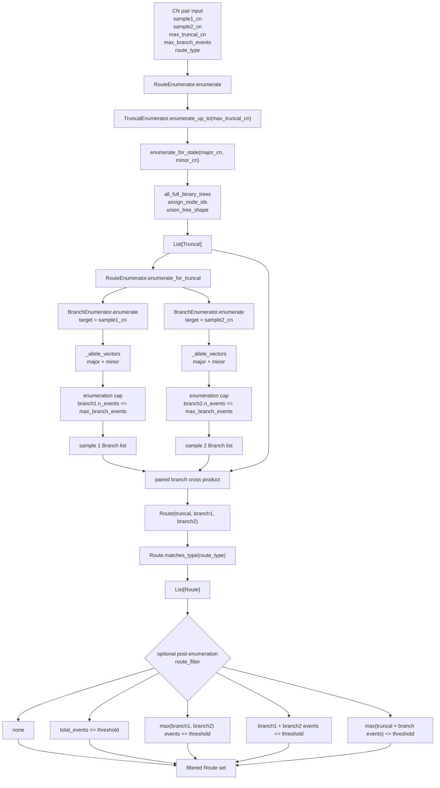

# Enumeration Flow

```mermaid
flowchart TD
    input["CN pair input<br/>sample1_cn<br/>sample2_cn<br/>max_truncal_cn<br/>max_branch_events<br/>route_type"] --> routeEnum["RouteEnumerator.enumerate"]

    routeEnum --> truncUpTo["TruncalEnumerator.enumerate_up_to(max_truncal_cn)"]
    truncUpTo --> truncState["enumerate_for_state(major_cn, minor_cn)"]
    truncState --> treeGen["all_full_binary_trees<br/>assign_node_ids<br/>union_tree_shape"]
    treeGen --> truncals["List[Truncal]"]

    truncals --> perTruncal["RouteEnumerator.enumerate_for_truncal"]
    perTruncal --> branch1["BranchEnumerator.enumerate<br/>target = sample1_cn"]
    perTruncal --> branch2["BranchEnumerator.enumerate<br/>target = sample2_cn"]

    branch1 --> allele1["_allele_vectors<br/>major + minor"]
    branch2 --> allele2["_allele_vectors<br/>major + minor"]
    allele1 --> branchCap1["enumeration cap<br/>branch1.n_events <= max_branch_events"]
    allele2 --> branchCap2["enumeration cap<br/>branch2.n_events <= max_branch_events"]
    branchCap1 --> branches1["sample 1 Branch list"]
    branchCap2 --> branches2["sample 2 Branch list"]

    branches1 --> product["paired branch cross product"]
    branches2 --> product
    truncals --> product
    product --> route["Route(truncal, branch1, branch2)"]
    route --> typeFilter["Route.matches_type(route_type)"]
    typeFilter --> routes["List[Route]"]
    routes --> postFilter{"optional post-enumeration<br/>route_filter"}
    postFilter --> noFilter["none"]
    postFilter --> total["total_events <= threshold"]
    postFilter --> maxBranch["max(branch1, branch2) events <= threshold"]
    postFilter --> branchSum["branch1 + branch2 events <= threshold"]
    postFilter --> singleSample["max(truncal + branch events) <= threshold"]
    noFilter --> finalRoutes["filtered Route set"]
    total --> finalRoutes
    maxBranch --> finalRoutes
    branchSum --> finalRoutes
    singleSample --> finalRoutes
```
