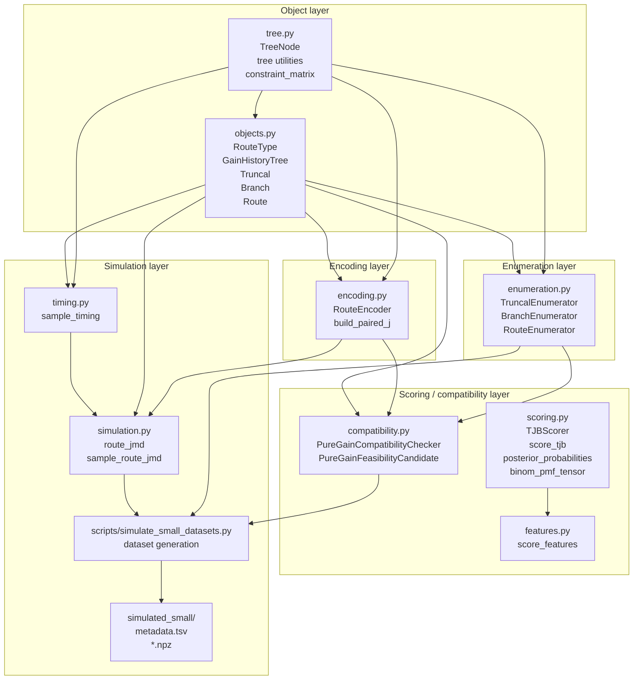

# Layered Architecture

```mermaid
flowchart TD
    subgraph ObjectLayer["Object layer"]
        tree["tree.py<br/>TreeNode<br/>tree utilities<br/>constraint_matrix"]
        objects["objects.py<br/>RouteType<br/>GainHistoryTree<br/>Truncal<br/>Branch<br/>Route"]
    end

    subgraph EnumerationLayer["Enumeration layer"]
        enumeration["enumeration.py<br/>TruncalEnumerator<br/>BranchEnumerator<br/>RouteEnumerator"]
    end

    subgraph EncodingLayer["Encoding layer"]
        encoding["encoding.py<br/>RouteEncoder<br/>build_paired_j"]
    end

    subgraph NumericLayer["Scoring / compatibility layer"]
        scoring["scoring.py<br/>TJBScorer<br/>score_tjb<br/>posterior_probabilities<br/>binom_pmf_tensor"]
        compatibility["compatibility.py<br/>PureGainCompatibilityChecker<br/>PureGainFeasibilityCandidate"]
        features["features.py<br/>score_features"]
    end

    subgraph SimulationLayer["Simulation layer"]
        timing["timing.py<br/>sample_timing"]
        simulation["simulation.py<br/>route_jmd<br/>sample_route_jmd"]
        script["scripts/simulate_small_datasets.py<br/>dataset generation"]
        outputs["simulated_small/<br/>metadata.tsv<br/>*.npz"]
    end

    tree --> objects
    tree --> enumeration
    objects --> enumeration
    tree --> encoding
    objects --> encoding
    enumeration --> compatibility
    encoding --> compatibility
    objects --> compatibility
    encoding --> simulation
    objects --> simulation
    tree --> timing
    objects --> timing
    timing --> simulation
    enumeration --> script
    compatibility --> script
    simulation --> script
    scoring --> features
    script --> outputs
```
