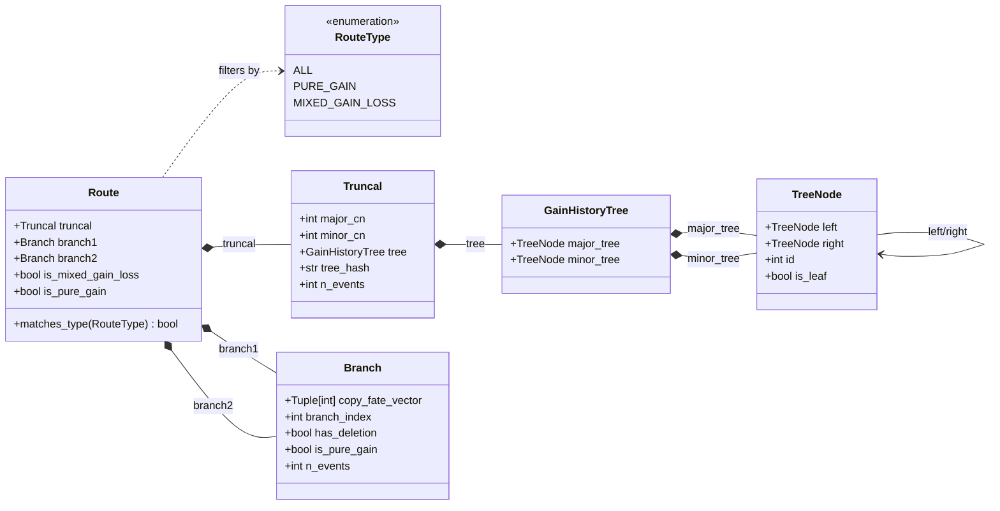

# Object Model

```mermaid
classDiagram
    direction LR

    class RouteType {
        <<enumeration>>
        ALL
        PURE_GAIN
        MIXED_GAIN_LOSS
    }

    class TreeNode {
        +TreeNode left
        +TreeNode right
        +int id
        +bool is_leaf
    }

    class GainHistoryTree {
        +TreeNode major_tree
        +TreeNode minor_tree
    }

    class Truncal {
        +int major_cn
        +int minor_cn
        +GainHistoryTree tree
        +str tree_hash
        +int n_events
    }

    class Branch {
        +Tuple[int] copy_fate_vector
        +int branch_index
        +bool has_deletion
        +bool is_pure_gain
        +int n_events
    }

    class Route {
        +Truncal truncal
        +Branch branch1
        +Branch branch2
        +bool is_mixed_gain_loss
        +bool is_pure_gain
        +matches_type(RouteType) bool
    }

    TreeNode --> TreeNode : left/right
    GainHistoryTree *-- TreeNode : major_tree
    GainHistoryTree *-- TreeNode : minor_tree
    Truncal *-- GainHistoryTree : tree
    Route *-- Truncal : truncal
    Route *-- Branch : branch1
    Route *-- Branch : branch2
    Route ..> RouteType : filters by
```
