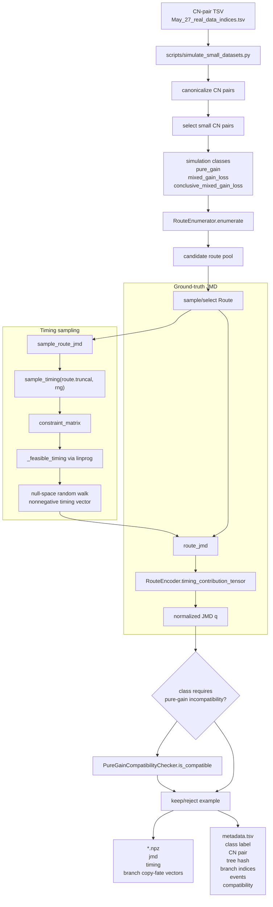

# Simulation Workflow

```mermaid
flowchart TD
    cnTsv["CN-pair TSV<br/>May_27_real_data_indices.tsv"] --> script["scripts/simulate_small_datasets.py"]
    script --> canonical["canonicalize CN pairs"]
    canonical --> select["select small CN pairs"]

    select --> classes["simulation classes<br/>pure_gain<br/>mixed_gain_loss<br/>conclusive_mixed_gain_loss"]
    classes --> routeEnum["RouteEnumerator.enumerate"]
    routeEnum --> routePool["candidate route pool"]

    routePool --> routePick["sample/select Route"]
    routePick --> sampleRoute["sample_route_jmd"]

    subgraph Timing["Timing sampling"]
        sampleRoute --> sampleTiming["sample_timing(route.truncal, rng)"]
        sampleTiming --> constraints["constraint_matrix"]
        constraints --> feasible["_feasible_timing via linprog"]
        feasible --> randomWalk["null-space random walk<br/>nonnegative timing vector"]
    end

    subgraph JMD["Ground-truth JMD"]
        randomWalk --> routeJmd["route_jmd"]
        routePick --> routeJmd
        routeJmd --> encoder["RouteEncoder.timing_contribution_tensor"]
        encoder --> q["normalized JMD q"]
    end

    q --> compat{"class requires<br/>pure-gain incompatibility?"}
    compat --> checker["PureGainCompatibilityChecker.is_compatible"]
    checker --> keepOrReject["keep/reject example"]
    compat --> keepOrReject

    keepOrReject --> npz["*.npz<br/>jmd<br/>timing<br/>branch copy-fate vectors"]
    keepOrReject --> metadata["metadata.tsv<br/>class label<br/>CN pair<br/>tree hash<br/>branch indices<br/>events<br/>compatibility"]
```
