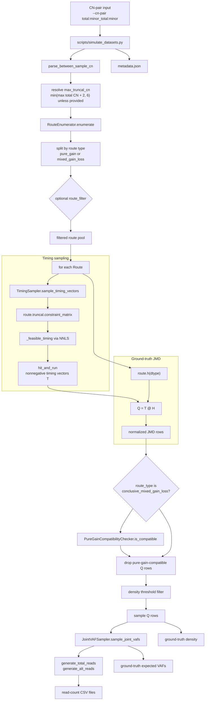

# Simulation Workflow

```mermaid
flowchart TD
    input["CN-pair input<br/>--cn-pair total:minor_total:minor"] --> script["scripts/simulate_datasets.py"]
    script --> parse["parse_between_sample_cn"]
    parse --> truncalCap["resolve max_truncal_cn<br/>min(max total CN + 2, 6) unless provided"]

    truncalCap --> routeEnum["RouteEnumerator.enumerate"]
    routeEnum --> routeType["split by route type<br/>pure_gain or mixed_gain_loss"]
    routeType --> routeFilter{"optional route_filter"}
    routeFilter --> routePool["filtered route pool"]

    routePool --> perRoute["for each Route"]

    subgraph Timing["Timing sampling"]
        perRoute --> sampleTiming["TimingSampler.sample_timing_vectors"]
        sampleTiming --> constraints["route.truncal.constraint_matrix"]
        constraints --> feasible["_feasible_timing via NNLS"]
        feasible --> hitAndRun["hit_and_run<br/>nonnegative timing vectors T"]
    end

    subgraph JMD["Ground-truth JMD"]
        perRoute --> h["route.h(dtype)"]
        hitAndRun --> th["Q = T @ H"]
        h --> th
        th --> q["normalized JMD rows"]
    end

    q --> compat{"route_type is<br/>conclusive_mixed_gain_loss?"}
    compat --> checker["PureGainCompatibilityChecker.is_compatible"]
    checker --> keepOrReject["drop pure-gain-compatible Q rows"]
    compat --> keepOrReject
    keepOrReject --> densityFilter["density threshold filter"]
    densityFilter --> sampleQ["sample Q rows"]
    sampleQ --> vaf["JointVAFSampler.sample_joint_vafs"]
    vaf --> reads["generate_total_reads<br/>generate_alt_reads"]

    reads --> csv["read-count CSV files"]
    sampleQ --> truth["ground-truth density"]
    vaf --> truthVaf["ground-truth expected VAFs"]
    script --> metadata["metadata.json"]
```
